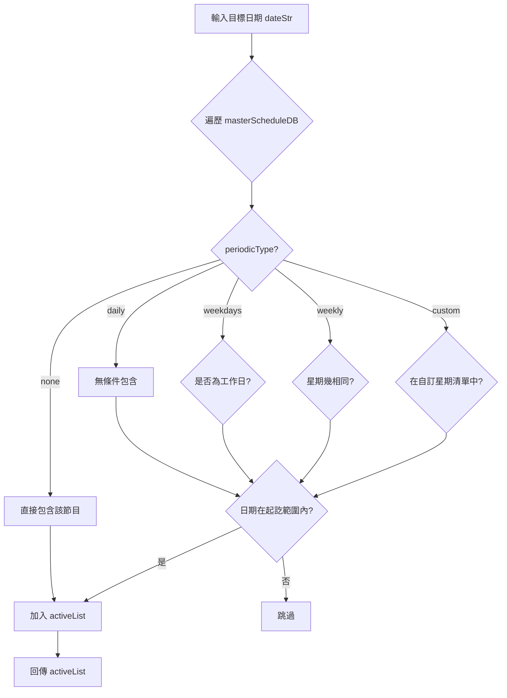
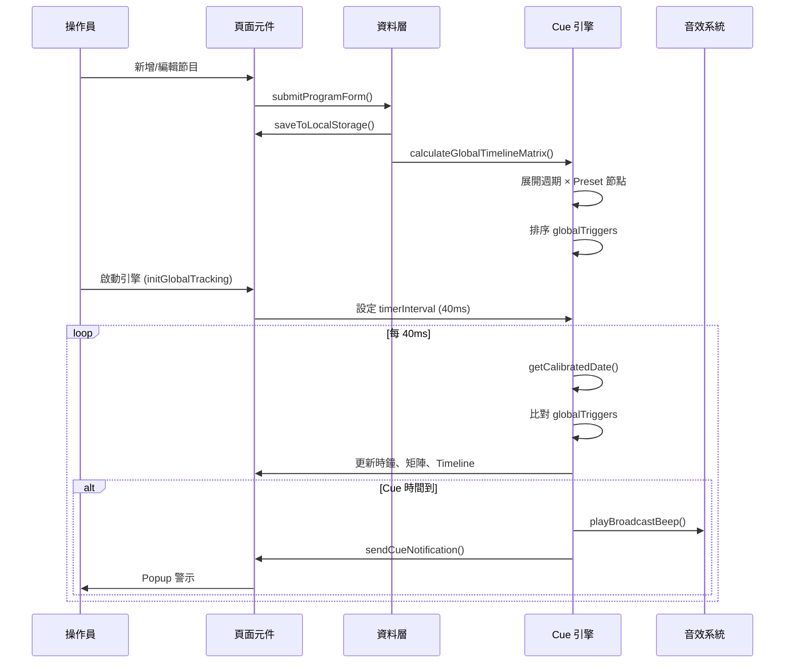

# ⚡ 快速開始

## 需求
- Python 3.10+
- 網路連線（NTP 校時用，可不連線但會降級至本地時鐘）

## 安裝與啟動
```bash
# 1. 安裝依賴
pip install -r requirements.txt

# 2. 啟動伺服器（自動開啟瀏覽器）
python server.py
```

瀏覽器自動開啟 `http://localhost:8000`，您的主控台就在這裡！

## 🆕 v0.6 新功能
- **真實 NTP 校時** — 使用 ntplib 連接香港天文台 stdtime.gov.hk，精度 ±5ms
- **Python 後端** — FastAPI + SQLite，資料不再受瀏覽器限制
- **自動備份** — 每次啟動自動備份資料庫
- **開罐即用** — 一條指令啟動完整系統

---

# County — 廣播排控倒數系統架構文件

## 📋 目錄
1. [系統概述](#1-系統概述)
2. [檔案結構](#2-檔案結構)
3. [前端頁面架構](#3-前端頁面架構)
4. [資料模型](#4-資料模型)
5. [核心引擎](#5-核心引擎)
6. [關鍵函數與資料流](#6-關鍵函數與資料流)
7. [事件流圖](#7-事件流圖)
8. [CSS 元件樹](#8-css-元件樹)
9. [儲存與設定](#9-儲存與設定)
10. [已知限制與注意事項](#10-已知限制與注意事項)
11. [NTP 時間服務](#11-ntp-時間服務v06-新增)

---

## 1. 系統概述

**County** 是一個廣播電視台排控中心的 **單頁應用 (SPA)**，提供以下核心功能：

- **節目排程管理** — CRUD 管理常規/週期性節目，支援行事曆視圖
- **Preset Cue 預設集** — 為每個節目設定提示點（Cue Point）的時間偏移與提示音
- **即時 Cue 觸發引擎** — 自動化監測時間軸，在每個 Cue 點觸發提示音與 UI 警示
- **時間軸視覺化** — Timeline 圖形化顯示各節目時段與 Cue 刻度位置

**核心概念：** 以影格 (Frame) 為時間單位（預設 PAL 25fps），所有時間計算統一透過 `timecodeToTotalFrames()` 與 `totalFramesToTimecode()` 轉換。

---

## 2. 檔案結構

```
county/
├── server.py                        # 🚀 Python 後端伺服器 (FastAPI + SQLite + ntplib)
├── requirements.txt                 # Python 依賴
├── templates/
│   └── index.html                   # 📄 主系統 SPA（JS/CSS/HTML 集中此檔）
├── static/                          # 靜態資源目錄
├── backups/                         # 自動備份目錄
├── county.db                       # SQLite 資料庫（執行後自動產生）
├── README.md                        # 📄 本架構文件
├── AGENTS.md                        # Agent 工作指引
├── CHANGELOG.md                     # 版本歷史
└── templates/index.html          # 前端 SPA（由 server.py 提供服務）
```

> ⚠️ `templates/index.html` 為目前主系統 SPA，由 `server.py` 提供服務。
> 使用時無需直接開啟 HTML 檔案，執行 `python server.py` 即可。

## 3. 前端頁面架構

### 整體佈局

```
┌──────────────────────────────────────┐
│  Sidebar (260px)  │    Main Content  │
│  ┌──────────────┐ │  ┌────────────┐ │
│  │ County 排控  │ │  │ Status Bar │ │
│  │ 調度中心 v0.5 │ │  │ (時鐘+NTP) │ │
│  ├──────────────┤ │  ├────────────┤ │
│  │ 📡 首頁       │ │  │            │ │
│  │ 📅 排程       │ │  │  Page Area │ │
│  │ 📋 Preset    │ │  │ (動態切換) │ │
│  │ 🛠️ 設定      │ │  │            │ │
│  │ 📜 更新日誌   │ │  │            │ │
│  │ 📖 說明      │ │  │            │ │
│  ├──────────────┤ │  └────────────┘ │
│  │ 引擎狀態      │ │                 │
│  └──────────────┘ │                 │
└──────────────────────────────────────┘
```

### 頁面路由

| 選單項目 | 頁面 ID | 功能說明 |
|---------|---------|---------|
| 📡 首頁 | `page-live` | MCR 儀表板：即時節目、Cue 倒數、時間軸矩陣、Cue 即時看板 |
| 📅 排程 | `page-rundown` | 行事曆 + 節目 CRUD 表單 + 本週縱覽 + 節目表 |
| 📋 Preset | `page-preset` | Preset 管理器：節點設定、JSON 匯出入、排序 |
| 🛠️ 設定 | `page-settings` | 系統設定：時區、影格率、提示音、NTP、開發者選項 |
| 📜 更新日誌 | `page-changelog` | 版本歷史與更新事項 |
| 📖 說明 | `page-help` | 操作說明與快捷鍵一覽 |

### 首頁 (MCR Home) 元件層級

```
page-live
├── mcr-operator-grid
│   ├── mcr-monitor-card (目前播出節目 + 下一檔次)
│   │   ├── mcr-tag-live (ON AIR 閃爍標籤)
│   │   ├── mcr-prog-title
│   │   ├── mcr-prog-countdown (離結束倒數)
│   │   └── mcr-next-bar (下一檔節目)
│   │
│   └── traffic-summary-card
│       ├── 今日總節目數
│       ├── 時序安全狀態
│       └── 自動化時序探針核心 (引擎啟動按鈕)
│
├── homeCueCountdown (醒目 Cue 倒數大看板) ← 本輪新增
│
├── panel-box (時序矩陣)
│   ├── timeline-panel (時間軸圖形)
│   │   ├── 時間範圍標籤
│   │   ├── timeline-tracks-wrap
│   │   │   ├── timeline-ruler (刻度)
│   │   │   ├── timeline-track (節目軌道)
│   │   │   ├── timeline-now-marker (現在游標)
│   │   │   └── timeline-now-label
│   │   └── 時間範圍標籤
│   │
│   ├── Cue 即時看板 (當前 Cue / 下一 Cue)
│   ├── matrix-scroll-wrap
│   │   └── matrixTableBody (觸發點矩陣清單)
│   └── console-terminal (除錯終端)
```

---

## 4. 資料模型

### 4.1 主排程資料庫 (`masterScheduleDB`)

```javascript
// Array 型態
[
  {
    id: "P_1746000000000",        // 唯一識別碼
    name: "晚間新聞",              // 節目名稱
    broadcastDate: "2026-06-19",  // 播出日期 (YYYY-MM-DD)
    startTime: "18:30:00:00",     // 開播時碼 (HH:MM:SS:FF)
    duration: "00:30:00:00",      // 長度
    periodicType: "daily" | "weekdays" | "weekly" | "custom" | "none",
    periodicEndDate: "2026-12-31", // 週期終止日
    periodicDays: [1, 3, 5],      // 自訂星期 (0=日, 1=一...)
    presetId: "std_news",          // 關聯的 Preset ID
    tags: ["即時", "重點"],        // 標籤
    colorLabel: "#ef4444"         // 顏色標籤（空=自動分配）
  }
]
```

### 4.2 Cue Preset (`cuePresets`)

```javascript
// Object 型態 (key = preset ID)
{
  "std_news": {
    name: "標準新聞 (News)",
    nodes: [
      {
        offset: -30,             // 負數 = 開始前 N 秒；正數 = 開始後 N 秒
                                 // "e-5" = 結束前 5 秒；"e0" = 結束時
        name: "30s 前 (Pre-Air 30s)",
        freq: 600,                // 提示音頻率
        soundId: "bell"           // 對應 soundPresets 的 ID
      },
      // ...更多節點
    ]
  }
}
```

**節點偏移類型：**

| offsetType | offset 值範例 | 意義 |
|-----------|-------------|------|
| 開始前 | `-300` | 開播前 300 秒 |
| 開始後 | `60` | 開播後 60 秒 |
| 結束前 | `"e-60"` | 結束前 60 秒 |
| 結束時 | `"e0"` | 結束瞬間 |

### 4.3 音效預設 (`soundPresets`)

```javascript
[
  { id: "short_beep",  label: "短促 Beep",     freq: 800,  dur: 0.15, repeats: 1, gap: 0,    type: "sine" },
  { id: "double_beep", label: "雙短 Beep (2x)", freq: 1000, dur: 0.15, repeats: 2, gap: 0.12, type: "sine" },
  { id: "triple_beep", label: "三短 Beep (3x)", freq: 1200, dur: 0.12, repeats: 3, gap: 0.08, type: "sine" },
  { id: "long_beep",   label: "長響 Beep",      freq: 1500, dur: 0.8,  repeats: 1, gap: 0,    type: "sine" },
  { id: "double_long", label: "雙長響 (2x)",     freq: 1500, dur: 0.7,  repeats: 2, gap: 0.15, type: "sine" },
  { id: "alert",       label: "急促 Alert (3x)", freq: 2000, dur: 0.1,  repeats: 3, gap: 0.06, type: "square" },
  { id: "chime",       label: "柔和 Chime",      freq: 1500, dur: 0.5,  repeats: 1, gap: 0,    type: "sine" },
  { id: "bell",        label: "低沈 Bell",       freq: 400,  dur: 0.5,  repeats: 1, gap: 0,    type: "sine" },
  { id: "tone",        label: "標準 Tone",       freq: 1000, dur: 0.3,  repeats: 1, gap: 0,    type: "sine" },
  { id: "silent",      label: "靜音 (無提示)",    freq: 0,    dur: 0,    repeats: 0, gap: 0,    type: "sine" }  // ← 靜音選項
]
```

### 4.4 全域觸發點 (`globalTriggers`)

引擎啟動後，由 `calculateGlobalTimelineMatrix()` 根據當日節目展開結果產生：

```javascript
[
  {
    progId: "P_1746000000000",
    progName: "晚間新聞",
    progTags: ["即時", "重點"],
    cueName: "30s 前 (Pre-Air 30s)",
    fullNodeName: "【晚間新聞】30s 前 (Pre-Air 30s)",
    targetFrames: 1665000,          // 觸發目標影格數
    timecodeStr: "18:29:30:00",     // 觸發目標時碼
    triggered: false,                // 是否已觸發
    freq: 600,
    soundPreset: { ... }            // 對應的完整 soundPreset 物件
  }
]
```

### 4.5 應用設定 (`appConfig`)

```javascript
{
  timezone: "Asia/Hong_Kong",       // 時區
  frameRate: 25,                    // 影格率 (預設 PAL)
  retentionSeconds: 5,              // Cue 觸發保留視窗 (秒)
  beepFreq: 1500,                   // 測試提示音頻率
  beepDuration: 0.5,                // 測試提示音長度
  calendarMemoryDays: 30            // 行事曆記憶天數
}
```

---

## 5. 核心引擎

### 5.1 引擎生命週期

```
initGlobalTracking()
├── 檢查當日是否有節目資料
├── 設定 isTrackingActive = true
├── 更新 UI 引擎狀態
├── calculateGlobalTimelineMatrix(false) ← 初次計算
└── 啟動 timerInterval
    └── setInterval(onLivePage ? updateGlobalDashboard : checkCueTriggersOnly, 40)
```

### 5.2 兩個 Timer 模式

| 模式 | 觸發條件 | 執行函數 | 更新範圍 |
|------|---------|---------|---------|
| 全儀表板 | 當前頁面 = `page-live` | `updateGlobalDashboard` | 時鐘、節目面板、矩陣、Cue 觸發、Timeline 游標 |
| 輕量 Cue | 其他頁面 | `checkCueTriggersOnly` | 僅 Cue 觸發檢查 |

### 5.3 時間計算

```
dateToTimecode(date): "HH:MM:SS:FF"
  └─ 將 Date() 物件轉為時碼字串 (以當日 00:00:00:00 為基準)

timecodeToTotalFrames(tc): number
  └─ HH * 3600 * frameRate + MM * 60 * frameRate + SS * frameRate + FF

totalFramesToTimecode(frames): "HH:MM:SS:FF"
  └─ 反向轉換

getCalibratedDate(): Date
  └─ 考慮時區偏移與 timeOffset，回傳校正後的目前時間

getExpandedRundownForDate(dateStr): Program[]
  └─ 展開週期性節目，回傳指定日期的所有有效節目清單
```

### 5.4 Cue 觸發機制

```
checkCueTriggersOnly() / updateGlobalDashboard()
└─ 每 40ms 檢查每個 globalTriggers[i]
   └─ diff = targetFrames - currentTotalFrames
       ├─ diff <= 0 && diff > -retentionFrames → CUE 觸發
       │   ├─ 播放提示音 (playBroadcastBeep)
       │   ├─ 顯示 Popup (sendCueNotification)
       │   └─ 標記 triggered = true
       └─ 否則 → 依接近程度分類高亮
           ├─ top1 → row-imminent (⬤ 紅底)
           ├─ top2/top3 → row-future (● 黃色)
           └─ 其餘 → row-dimmed (○ 灰底)
```

---

## 6. 關鍵函數與資料流

### 6.1 JavaScript 模組劃分

```javascript
// 區段標記 (依原始碼行號範圍)
// 1. CSS 與 HTML 結構          (1-338  CSS)
// 2. HTML 頁面結構              (339-967 HTML)
// 3. 全域變數與初始化           (976-1100)
// 4. 時間/時碼工具函數          (1101-1275)
// 5. 時碼輸入遮罩               (1276-1304)
// 6. 行事曆                     (1305-1430)
// 7. 週期展開                   (1431-1500)
// 8. 日誌系統                   (1501-1540)
// 9. 週期 UI                    (1541-1590)
// 10. 行事曆渲染                (1591-1726)
// 11. 音效系統 (soundPresets)   (1727-1740)
// 12. Preset 節點表格操作       (1742-1970)
// 13. Preset CRUD               (1971-2054)
// 14. 排程 CRUD                 (2328-2488)
// 15. 引擎                      (2634-2897)
// 16. 儀表板 (Dashboard)        (2900-3095)
// 17. 提示 Popup                (3097-3163)
// 18. 開發者選項 / 除錯         (3165-3243)
```

### 6.2 主要資料流

```
使用者操作 → 排程 CRUD
  ├─ submitProgramForm()
  ├─ enterEditMode(id) / exitEditMode()
  ├─ deleteProgram(id)
  ├─ duplicateProgram(id)
  └─ clearAllPrograms()
       └─ saveToLocalStorage() ──→ localStorage["county_master_db_v8"]

引擎啟動
  └─ initGlobalTracking()
       └─ calculateGlobalTimelineMatrix()
            ├─ getExpandedRundownForDate(targetDate)
            ├─ 展開週期節目 → activeList
            ├─ 遍歷每個節目 × 每個 Preset 節點
            ├─ 計算 targetFrames
            └─ globalTriggers.sort()

每 40ms 定時器
  └─ updateGlobalDashboard()
       ├─ getCalibratedDate() → currentTotalFrames
       ├─ 比較 globalTriggers 與 currentTotalFrames
       ├─ 更新 UI:
       │   ├─ mcrOnAirCard (當前/下一檔節目)
       │   ├─ matrix 矩陣 (高亮、可見範圍)
       │   ├─ Timeline 游標位置
       │   ├─ Cue 即時看板
       │   └─ homeCueCountdown ← 本輪新增
       └─ 觸發 Cue 事件 → playBroadcastBeep() + sendCueNotification()
```

### 6.3 週期節目展開 (`getExpandedRundownForDate`)



---

## 7. 事件流圖



---

## 8. CSS 元件樹

### 8.1 色彩系統

| CSS 變數 | 值 | 用途 |
|----------|-----|------|
| `--primary-color` | `#38bdf8` | 主色調 (Sky 400) |
| `--bg-dark` | `#090d16` | 背景底色 |
| `--bg-panel` | `#111827` | 面板底色 |
| `--success` | `#10b981` | ON-AIR、安全狀態 |
| `--warning` | `#f59e0b` | 即將到來、警示 |
| `--danger` | `#ef4444` | 緊急、Cue 觸發 |
| `--on-air` | `#22c55e` | 直播標籤 |

### 8.2 節目色盤 (`MATRIX_COLORS`)

```javascript
const MATRIX_COLORS = [
  '#ef4444', '#f59e0b', '#10b981', '#3b82f6',
  '#8b5cf6', '#ec4899', '#06b6d4', '#f97316'
];
```

### 8.3 行狀態樣式

| CSS Class | 觸發條件 | 視覺效果 |
|-----------|---------|---------|
| `.row-trigger-active` | Cue 觸發瞬間 | 🔴 紅色底 + 閃爍動畫 |
| `.row-imminent` | 最接近的即將 Cue | 🟥 紅色字 + 粗體 |
| `.row-future` | 第 2-3 接近的 Cue | 🟨 黃色字 |
| `.row-dimmed` | 其餘 Cue | 灰色淡化 |
| `.row-onair` | 正在播出的節目行 | 🔴 左邊框 + 淡紅底閃爍 |
| `.row-nextup` | 下一檔節目行 | 🟠 左邊框 + 淡黃底 |

### 8.4 響應式中斷點

| 中斷點 | 影響 |
|--------|------|
| `1200px` | `.mcr-operator-grid` 切換為單欄 |
| `1024px` | `.grid-layout-2col` 切換為單欄 |
| `900px` | `.help-grid` 切換為單欄 |
| `768px` | `.input-form` 切換為單欄 ← 本輪新增 |

---

## 9. 儲存與設定

### 9.1 後端資料庫 (SQLite)

v0.6 開始使用 **SQLite** 作為主要資料儲存，所有排程、Preset、設定皆持久化在 `county.db` 中。

| 資料表 | 用途 | 說明 |
|--------|------|------|
| `schedules` | 主排程資料庫 | 節目 CRUD、週期設定、Preset 關聯 |
| `presets` | Cue Preset 庫 | Preset ID、名稱、節點 JSON |
| `config` | 應用設定 | Key-Value 設定值 |
| `ntp_logs` | NTP 同步日誌 | 每次 NTP 同步記錄 |

資料透過 FastAPI REST API (`/api/schedule`、`/api/preset`、`/api/config`) 存取，
前端使用非阻塞 fetch 呼叫，伺服器不可用時自動降級至 localStorage。

### 9.2 localStorage 快取（離線降級）

| Key | 內容 | 格式 |
|-----|------|------|
| `county_master_db_v8` | 主排程資料庫 | JSON Array |
| `county_presets_v8` | Cue Preset 庫 | JSON Object |
| `county_config_v8` | 應用設定 | JSON Object |
| `county_dismissed` | 已關閉的提示 | JSON Array |
| `county_ntp_*` (x4) | NTP 時間服務暫存 | 各別值 |

> 後端離線時，系統自動使用 localStorage 作為降級儲存，確保廣播作業不中斷。

### 9.3 設定頁面

在 `page-settings` 中可調整：

| 設定項 | 類型 | 說明 |
|-------|------|------|
| 時區 | Select | 預設為瀏覽器時區 |
| 影格率 | Number | PAL 25 / NTSC 29.97 / 24 / 30 |
| Cue 保留時間 | Number | 觸發後保持高亮秒數 |
| 提示音頻率 | Number | 測試音的頻率 |
| 提示音長度 | Number | 測試音的持續時間 |
| 行事曆記憶天數 | Number | 日曆可視範圍 |
| NTP 伺服器 | Input | NTP 伺服器位址（預設 `stdtime.gov.hk`） |
| NTP 同步間隔 | Number | 自動同步間隔（秒，0=關閉） |
| 引擎心跳間隔 | Input | 開發者選項：定時器間隔 (ms) |


## 10. 已知限制與注意事項

### 10.1 效能風險

- ⚠️ **40ms 定時器**：`updateGlobalDashboard` 每 40ms 執行完整 DOM 操作（className 切換、innerText 更新），在大量 Cue 點 (>200) 時可能造成效能瓶頸
- ⚠️ **innerHTML 累積**：`calculateGlobalTimelineMatrix()` 中使用 `matrixBody.innerHTML +=` 方式渲染，大量節點時可能導致記憶體累積

### 10.2 瀏覽器相容性

- 使用 `AudioContext`（Chrome/Firefox/Safari 支援，需用戶手勢初始化）
- `Intl.DateTimeFormat` 時區功能（IE11 不支援）
- CSS `aspect-ratio`（Chrome 79+/Firefox 87+）

### 10.3 資料安全

- **主要儲存**：所有資料持久化在 `county.db`（SQLite），伺服器重啟不遺失
- **自動備份**：伺服器每次啟動自動產生日期備份檔至 `backups/` 目錄
- **離線降級**：前端 localStorage 作為備援，後端不可用時仍可讀寫
- **無權限控管** — 所有操作員皆可修改所有設定

### 10.4 發展備註

- 2026-06-19: 新增靜音提示選項、Preset 排序邏輯修正、響應式輸入修正
- 2026-06-19: 新增首頁 Cue 倒數看板、快速修改面板、Timeline 懸浮提示
- 前次更新: CSS 選擇器清理、OOM 崩潰修復、多用戶信令升級

---

*本架構文件由 AI 輔助生成，最後更新於 2026-06-19*

---

## 11. NTP 時間服務（v0.6 新增）

### 11.1 概述
County v0.6 新增 **真實 NTP 校時** 功能，使用 Python `ntplib` 透過 UDP port 123 連接香港天文台 `stdtime.gov.hk`，精度可達 ±5ms。

### 11.2 架構

```
┌─────────────────┐     HTTP API      ┌──────────────────────┐
│   瀏覽器前端      │ ────────────────→ │  Python 後端 (FastAPI)│
│  NTPManager.js   │ ←──────────────── │  NTPManager (ntplib) │
│  (呼叫 /api/ntp/)│                   │  UDP 123             │
└─────────────────┘                   └──────────┬───────────┘
                                                 │
                                                 ▼
                                          ┌──────────────┐
                                          │  stdtime.gov.hk  │
                                          │ (香港天文台)   │
                                          └──────────────┘
```

### 11.3 前端 NTPManager（瀏覽器端）

```javascript
const NTPManager = {
    status: 'connected' | 'fallback' | 'local' | 'syncing' | 'error',
    offset: 0,              // serverTime - Date.now() (ms)
    lastSyncTime: null,     // ISO string
    errorMsg: '',
    config: {
        ntpServerUrl: 'stdtime.gov.hk',
        ntpAutoSyncInterval: 600,   // seconds
    },
    timerId: null,          // auto-sync setInterval ID
    async sync(url) { ... } // 呼叫後端 /api/ntp/sync
};
```

- `sync()` 透過 `API.ntpSync()` 呼叫後端 `/api/ntp/sync`
- 後端回傳 `{status, offset_ms, last_sync, error_msg}`
- 後端無法連線時，自動保留上次成功偏移量並降級至 `local` 狀態

### 11.4 後端 NTPManager（Python ntplib）

```python
class NTPManager:
    def __init__(self):
        self.status = 'local'
        self.offset_ms = 0.0
        self.server_url = 'stdtime.gov.hk'

    def sync(self) -> dict:
        """使用 ntplib 透過 UDP 123 進行真實 NTP 同步"""
        import ntplib
        client = ntplib.NTPClient()
        response = client.request(self.server_url, version=3, timeout=5)
        self.offset_ms = response.offset * 1000  # 秒 → 毫秒
        # ...
```

| 端點 | 方法 | 說明 |
|------|------|------|
| `/api/ntp/status` | GET | 回傳目前 NTP 狀態與偏移量 |
| `/api/ntp/sync` | POST | 觸發即時 NTP 同步 |

### 11.5 設定項目

| 設定項 | ID | 類型 | 說明 |
|-------|-----|------|------|
| NTP 伺服器 | `cfgNtpUrl` | Input | NTP 伺服器位址（預設 `stdtime.gov.hk`） |
| 自動同步間隔 | `cfgNtpInterval` | Number | 秒數（0=關閉，預設 600） |
| 狀態 | `settingsNtpStatus` | Display | 🟢 已同步 / ⚠️ 降級 / 🔴 錯誤 |
| 立即同步 | `btnNtpSync` | Button | 手動觸發同步 |

### 11.6 持久化
- **後端**：每次 NTP 同步記錄寫入 `county.db` 的 `ntp_logs` 資料表
- **前端**：偏移量與最後同步時間暫存於 localStorage（`county_ntp_*`），作為後端離線時的備援
- **Config**：NTP 設定也保存在 `appConfig.ntp*` 字段中，可透過 Config JSON 面板匯出/匯入

### 11.7 已知限制
- ⚠️ **UDP port 123 必須開放** — NTP 同步使用 UDP 協定，若防火牆阻擋則無法同步
- ⚠️ **`stdtime.gov.hk` 為香港天文台 NTP 伺服器** — 若在非香港區域或該伺服器不可用，系統自動降級至本地時鐘
- ⚠️ **偏移量精度受網路延遲影響** — 一般情況下 ntplib 可達 ±5ms 精度
- ⚠️ **後端離線時** — 前端自動降級至 localStorage 的上次成功偏移量

### 11.8 發展備註
- 2026-06-20: 新增 Python ntplib NTP 同步、FastAPI `/api/ntp/` 端點、前端 NTP 設定面板、自動同步定時器、啟動時自動同步

*本架構文件由 AI 輔助生成，最後更新於 2026-06-20*
